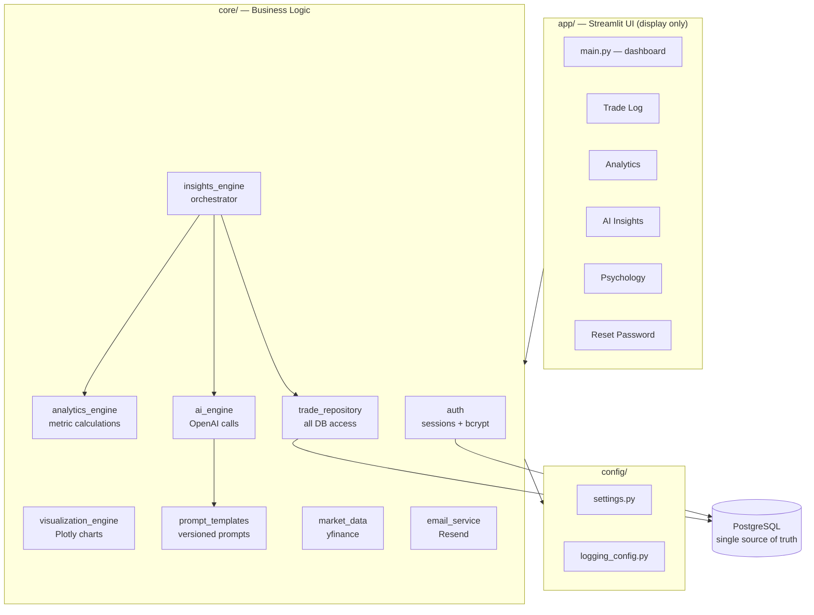

# AI Trading Journal Intelligence System

A production-grade behavioral analytics platform that uses GPT-4o to detect the **psychological patterns** behind trading decisions and quantify what they cost — turning a trade log into a coaching system.

**Live demo:** [https://trading-journal-production-921d.up.railway.app](https://trading-journal-production-921d.up.railway.app)

---

## The Problem

Most retail traders lose money not because they lack strategy, but because of psychology — FOMO, revenge trading, moving stop losses, cutting winners early. Existing trading journals record *what* happened. They tell you why you lost **after** you lost.

This system is built around a different idea: **track the psychology behind every trade, then use AI to surface the behavioral patterns the trader cannot see themselves** — with the real dollar cost attached.

> Example output the system generates from real data:
> *"Your anxious trades have a 0% win rate across 12 trades and have cost you $1,224 so far. Your calm trades win 87% of the time. Your problem is not strategy — it is trading while anxious."*

---

## What It Does

- **Psychology-aware trade logging** — captures emotional state, confidence, reasoning, and plan-adherence alongside price data
- **Behavioral analytics** — win rate by emotional state, FOMO impact, confidence calibration, plan adherence
- **Risk metrics** — Sharpe ratio, Calmar ratio, drawdown, R:R discipline
- **AI trade analysis** — GPT-4o grades each trade's *process* independent of its outcome
- **Pattern detection** — identifies systematic behavioral biases across the full trade history and quantifies their realized cost
- **Weekly AI coaching** — generates a behavioral review with one focused improvement target
- **Multi-user** — full authentication, password reset, and per-user data isolation

---

## Architecture

The system follows a strict layered architecture. Dependencies flow in one direction only: **UI → business logic → configuration**. The UI never touches the database; external APIs are isolated to single modules.




**Why this matters:** because all database access lives in `trade_repository`, migrating from SQLite to PostgreSQL required changing essentially one layer — the rest of the application never knew. Because OpenAI calls live only in `ai_engine`, swapping models or handling an API change touches one file.

---

## Key Design Decisions

**Repository Pattern for all data access.**
Every SQL statement lives in a repository class. Nothing else in the app writes SQL. This centralization is what made the SQLite → PostgreSQL migration a single-layer change instead of a rewrite.

**External services isolated to single modules.**
OpenAI lives only in `ai_engine`, yfinance only in `market_data`, email only in `email_service`. If any vendor changes their API or pricing, exactly one file changes.

**Statistics are pre-computed before prompting the AI.**
Rather than dumping raw trades at GPT-4o, the analytics engine computes real metrics first, then feeds structured context with few-shot examples. This produces specific, grounded coaching instead of generic output — and uses far fewer tokens.

**Multi-tenancy enforced at the database layer.**
Every table carries a `user_id`; every query filters on it. Data isolation is not a UI convenience — it is a hard constraint at the query level.

**Environment-based configuration.**
A single environment variable switches the entire system between SQLite (fast local development) and PostgreSQL (concurrent production). No code changes between environments.

---

## Tech Stack


| Layer          | Technology                                    |
| -------------- | --------------------------------------------- |
| Frontend       | Streamlit                                     |
| Business logic | Python 3.13                                   |
| Data analysis  | pandas, numpy                                 |
| Visualization  | Plotly                                        |
| Database       | PostgreSQL (prod) / SQLite (dev) + SQLAlchemy |
| AI             | OpenAI GPT-4o                                 |
| Market data    | yfinance                                      |
| Auth           | bcrypt, session tokens                        |
| Email          | Resend                                        |
| Deployment     | Railway (auto-deploy from GitHub)             |


---

## Project Structure

```
app/                      Streamlit UI — display only
  main.py                 dashboard
  auth.py                 login / register / reset gate
  utils.py                shared helpers
  pages/                  trade log, analytics, AI insights, psychology
core/                     business logic
  trade_repository.py     all database access (Repository Pattern)
  analytics_engine.py     metric calculations (stateless)
  visualization_engine.py Plotly charts
  ai_engine.py            OpenAI integration (isolated)
  prompt_templates.py     AI prompts + few-shot examples
  insights_engine.py      orchestration layer
  auth.py                 authentication + sessions
  market_data.py          yfinance integration
  email_service.py        transactional email
config/
  settings.py             central configuration
  logging_config.py       structured logging
```

---

## Setup

**Requirements:** Python 3.9+

```bash
# Clone and enter
git clone https://github.com/aditya2562/trading-journal.git
cd trading-journal

# Virtual environment
python3 -m venv venv
source venv/bin/activate        # Windows: venv\Scripts\activate

# Install
pip install -r requirements.txt

# Configure
cp .env.example .env
# Edit .env and add your OPENAI_API_KEY

# Run
streamlit run app/main.py
```

Open `http://localhost:8501`.

---

## Environment Variables

```
OPENAI_API_KEY      Required for AI features
DATABASE_URL        Leave empty for local SQLite; set for PostgreSQL
DB_PATH             Local SQLite path (default: data/trading_journal.db)
RESEND_API_KEY      Required for password reset emails
APP_URL             Base URL for reset links
APP_ENV             development | production
LOG_LEVEL           DEBUG | INFO | WARNING | ERROR
```

---

## Roadmap

- CSV import from major brokers (reduce manual-entry friction)
- Pre-trade behavioral check ("your last 12 anxious trades averaged −$102 — proceed?")
- Cross-trade AI memory (continuity across analyses)
- Behavioral improvement tracking over time
- Subscription billing (Stripe)

---

## License

MIT